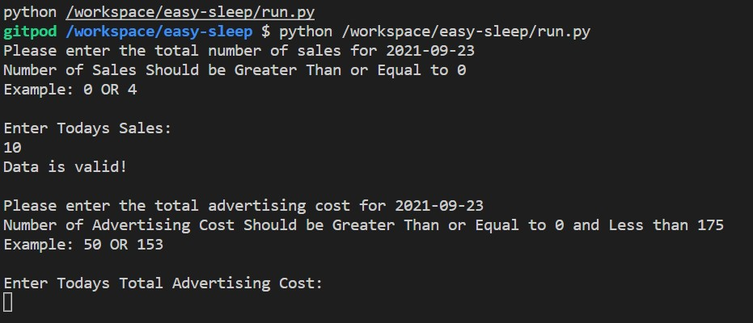
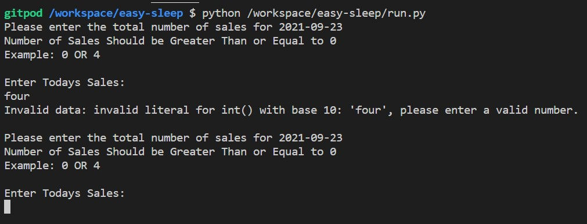
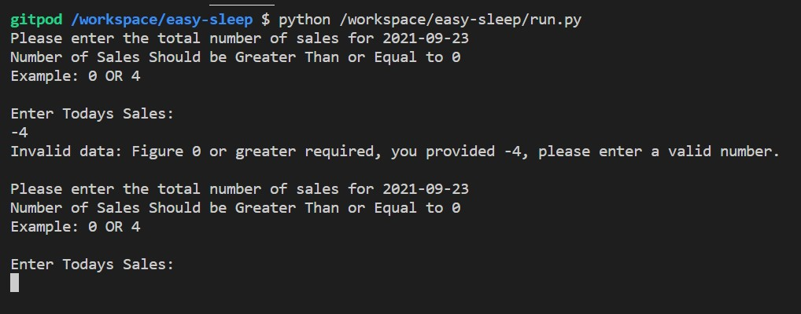
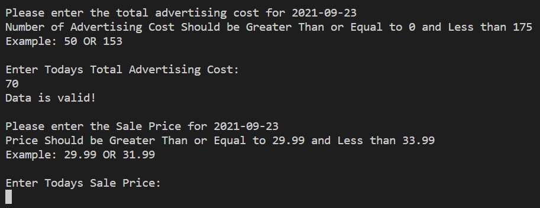
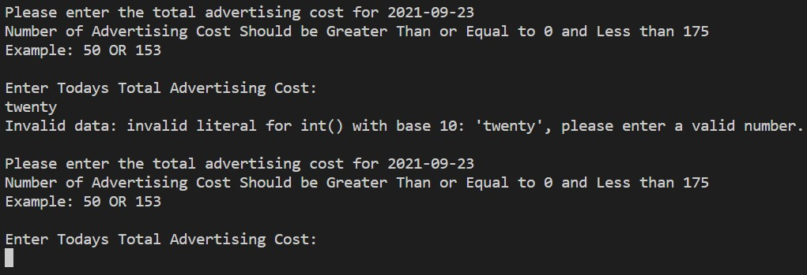
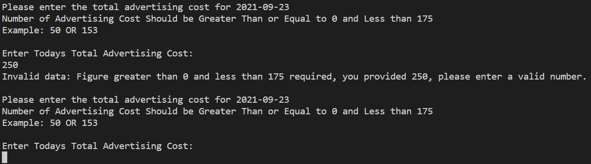

## About EasySeep

EasySleep is a brand that sells temporary blackout blinds, they sell their products on amazon but plan to sell on thier own using their own system to check stock sales etc.

## Uses

* This will allow the user to enter data via a terminal and it get inputted into a spreadsheet.
* It will allow the the user to retrieve calculation based on their input
* It will return a customer a daily summary for the user to see on the terminal

## How to Use 

* Run the run.py file
* Choose an option from A,B,C depending if you want to enter data, get the last summary, or all data
### Option A
* Input the total number of daily sales
* Next Imput the total advertising cost for that day
* Finally Input the price per unit that day
* System will calculate acos and order quantity an update spreadsheet
* The user will be then prompted to contiue or end.
### Option B
* Will show the previous days summary 
* The user will be then prompted to continue or end.
### Option C
* Will show all the data in the spreadsheet
* The user will be then prompted to continue or end.

## Features 

When you create the app, you will need to add two buildpacks from the _Settings_ tab. The ordering is as follows:
### Validation 
#### Daily Sales Input 
* The Input for Daily Sales will have validation that makes sure the information can be turned into an integer if not will return an error
* The Input for Daily Sales will also have a validation that only lets the user enter a number greater or equal to zero 
 #### Daily Advertising Input 
* The Input for Daily Advertising will have validation that makes sure the information can be turned into an integer if not will return an error
* The Input for Daily Advertising will also have a validation that only lets the user enter a number greater than zero and less than 175 as this the maximum budget for advertising per day
#### Daily Price Input 
* The Input for Price will have validation that makes sure the information can be turned into an Float if not will return an error
* The Input for Price Sales will also have a validation that only lets the user enter a number greater than 28.99 and less than 33.99 as this is the price range that the product sells depending on demand.
### Calculations 
* Once information has been inputted by user and all has been comfirmed and valid the function will calculate the ACOS based on the figures provided
### Information Return
* The functions will then return a 'Daily Summary' in the terminal of the inputted calculations as well as the calulations 
### API Spreasheet Update
* The spreasheet will get updated with user inputed data and calculations
### Choice
* The user will be given a choice on what they wish do to, enter data or view
* The user will be given a choice on if they would like to continue or not 

## Testing 
### Sales Input Function and Validation
* The Fuction should request the an input from the user and return "Data is valid" and continue to the next input.

* The function works Correctly when valid data is entered
* The validation should return errors when invalid data such as a something that can not be turned into an interger or a number outside the range. The function should also then request the user to re-enter valid data so the function does not end.

* The validation works correctly when data that cant be changed into an integer is entered, returning an error and asking the user to input correct data.

* The validation works correctly when data that is below zero is entered, showing an error and asking user to pinput valid data 
### Advertising Input Function and Validation
* The Fuction should request the an input from the user and return "Data is valid" and continue to the next input.

* The function works Correctly when valid data is entered
* The validation should return errors when invalid data such as a something that can not be turned into an interger or a number outside the range. The function should also then request the user to re-enter valid data so the function does not end.

* The validation works correctly when data that cant be changed into an integer is entered, returning an error and asking the user to input correct data.

* The validation works correctly when data that is below 0 or above 175 returning error and requesting the data to be entered again 

## Spreadsheet 
Link to spreadsheet https://docs.google.com/spreadsheets/d/1PdROOvZJ8ri_ZWFjpySQprSaOuknZzx5k9gvUY064fI/edit?usp=sharing

## Deployment
The project was deployed using Code Institutes mock terminal for Herokui
* Steps for Deployment
    * For